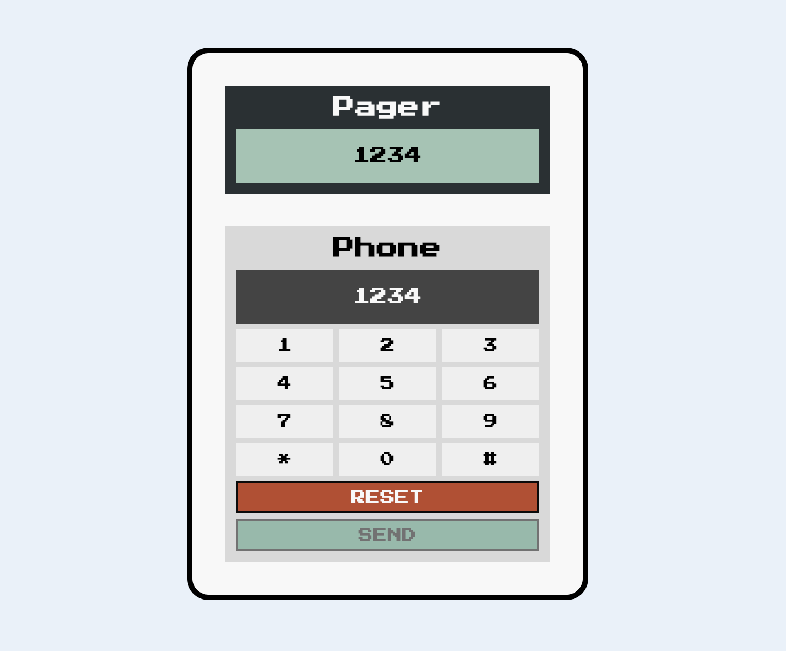

# Send To Pager

This project is a web-based "Send To Pager" application built entirely with HTML, CSS, and JavaScript. It features a simple interface with a phone display where users can input a number. Upon hitting the "Send" button, the number is sent with a delayed effect, accompanied by a pager sound, to the "Pager". The sent number appears in the "Pager Display" section. Users can then input another number, replacing the previous one in the display.

## Demo

[Live Demo](#)

## What I Learned

During the development of this project, I learned:

- More about Flexbox for layout purposes.
- How to utilize CSS pseudo-classes to dynamically change button colors based on their state (active or disabled).
- Basic DOM manipulation techniques using JavaScript to interact with and update webpage content dynamically.

## Credits

This project was created as part of Module 3 of the [Scrimba](https://www.scrimba.com/) Frontend Developer bootcamp.
